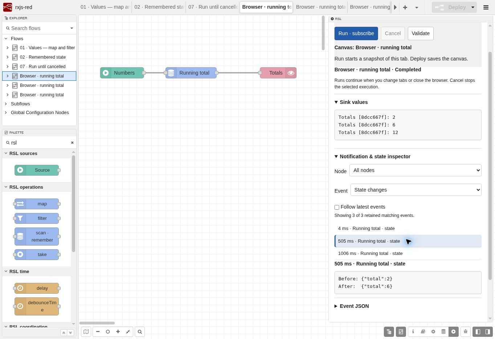
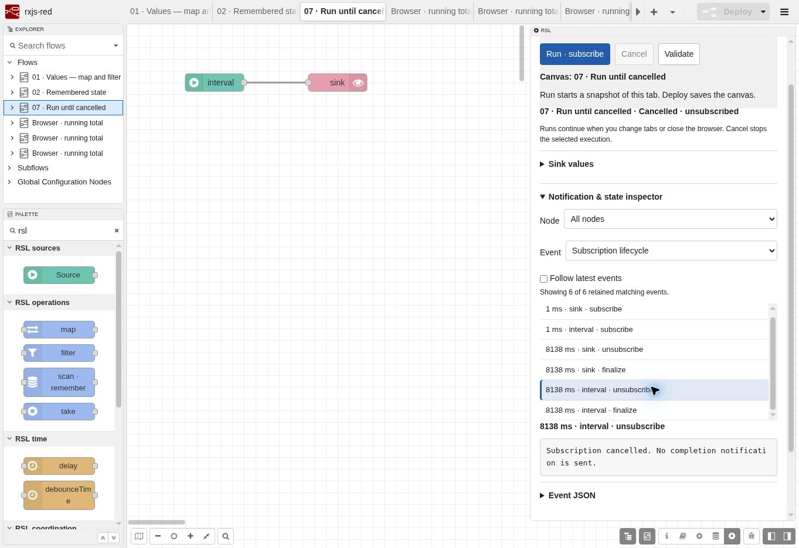

# Browser editor milestone

Date: 2026-09-07. Node-RED 5.0.6, RxJS 7.8.2. Tested in a desktop Chromium browser at 1363 × 936, with the embedded application running as a resident Node.js process.

## Result

Composing, running, cancelling, and inspecting supported RSL flows work through the native Node-RED editor. A new flow was created with actual palette drags, wire drags, and property-dialog edits. The browser controls were exercised directly; these observations are separate from the automated runtime tests.

The native composition experience is a useful foundation. Most friction was in the execution sidebar: ambiguous run status, opaque IDs, and losing the reader's place during updates. This milestone addresses those issues without changing the graph's RxJS behavior.

## Browser exercises

| Exercise | Observed result |
| --- | --- |
| Compose from an empty tab | Dragged Source, scan, and Sink from the palette, wired them, and named them Numbers, Running total, and Totals |
| Configure and run before Deploy | Values `[2,4,6]`, period `500`, reducer ``, seed `0`; emitted **2, 6, 12** and completed |
| Inspect remembered state | State changes filter showed three state changes; the middle one showed `{"total":2}` → `{"total":6}` |
| Keyboard inspection | Tab moved between event buttons; Enter selected the next event and showed `6` → `12` |
| Inspect while running | A selected interval subscription retained keyboard focus and selection across subsequent polls; automatic following stopped when the event was selected |
| Run and Cancel | The interval stopped emitting; Sink and Source recorded `unsubscribe` and `finalize`, with no `complete`; Cancel became disabled |
| Reload an active run | The same server-owned execution was selected automatically and could still be cancelled |
| Validate during execution | Canvas validation feedback appeared separately; execution status remained Running |
| Clear execution selection | Values, filters, context, and event list cleared; stale results no longer appeared to belong to an empty selection |
| JSON and YAML round trips | Exported the composed graph into the document field, imported each format into a fresh tab with new IDs, and reproduced **2, 6, 12** |
| Import navigation | Each imported flow became the active canvas; the sidebar identified that canvas and offered Run |
| Inspect inner cancellation | Adding the latest-inner example selected its new tab; it emitted only **50**, and the lifecycle filter showed four inner unsubscriptions before the final inner completed |
| Runtime expression error | A temporary division-by-zero reducer terminated the execution and automatically opened its finite-value contract diagnostic; the valid reducer was restored afterward |
| Deploy and reload | Valid RSL flows saved without the earlier source warning; saved canvas edits survived reload |

Browser wall-clock timings are observations, not timing tolerances. Virtual-time tests remain the authority for exact scheduling and teardown semantics.

## Changes prompted by the exercises

- Imports now select their new workspace through Node-RED's returned node mapping.
- Execution options update when a run reaches completion, cancellation, or error. Reload restores the newest active run, or the latest retained result.
- Canvas identity and validation feedback are separate from the selected execution's identity and status. Every Run still creates an independent snapshot.
- The run detail API captures node labels and operation names at execution creation. Later canvas edits cannot rename historical results.
- The inspector filters by node and event kind, shows compact before/after state, and retains full Event JSON. Runtime errors select their diagnostic automatically.
- Trace buttons retain their DOM identity during polling, preserving focus and selection. Follow latest events is explicit; bounds and omitted-event counts remain visible.
- Controls show pending actions and disable unavailable cancellation. Polling retries connection failures and handles an evicted run without displaying stale results.
- Palette entries use readable labels. Source dialogs show fields for the selected source kind, and missing/empty optional counts no longer invalidate a Values source.
- Hidden inspector elements stay hidden under Node-RED's styles. Run controls remain accessible while scrolling.
- Exports retain a visible download link as well as editable document text.
- The development command accepts host/port flags and watches built server modules. The default bind address remains loopback.

## Repeat the main exercise

1. Start the application and open the RSL sidebar. Filter the palette with `rsl`.
2. Add an empty flow. Drag Source, scan, and Sink onto it; connect Source → scan → Sink.
3. Configure `[2,4,6]` with a 500 ms period, a zero seed, and the sum reducer above. Give the nodes distinct names.
4. Validate, then Run without deploying. Check the totals and Completed status in both the status text and execution selector.
5. Filter Event to State changes. Select the middle event, then use Tab and Enter to inspect the last one.
6. Export JSON or YAML and import the document. Check that the new tab is selected and produces the same totals.
7. Add the cancellation example. Run, reload the browser, and Cancel. Filter to Subscription lifecycle and inspect unsubscription.

For a larger inspector, hide Debug messages with its sidebar button and drag the sidebar divider left. Both the default narrow layout and this expanded layout were exercised.

## Verification and limits

`npm run check` passes all **21 prototype tests** and **288 inherited evaluator tests**. The HTTP test now checks execution-owned labels; generated editor validation checks cover missing/empty optional counts. RxJS/compiler semantics and the vendored evaluator are unchanged.

This is an exercised desktop browser milestone, not a permanent browser regression suite, mobile certification, screen-reader audit, or multi-user usability study. Transport retry logic was reviewed but not tested through a forced network outage. Browser export generation and JSON/YAML imports passed; the browser automation's download-completion wait timed out for both automatic and explicit-link downloads, so downloaded-file delivery is **not marked verified**. The editable export text and persistent download link remain available.

The canonical general reaction executor, richer logical input editing, and user-defined Observable Workers remain separate milestones.
